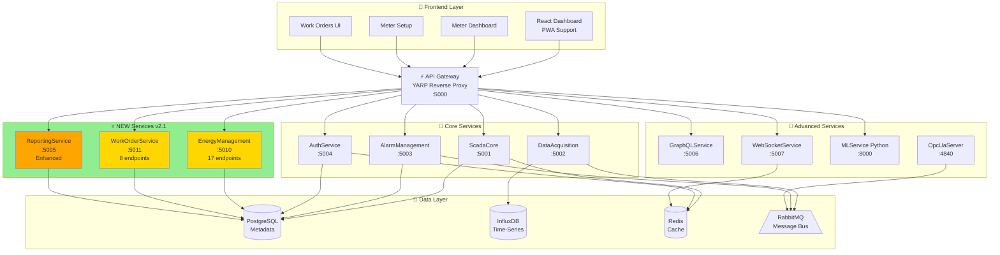

# 🏗️ Enterprise SCADA System v2.1 - Updated Architecture

**Version**: 2.1  
**Date**: 2025-01-08  
**Type**: Microservices + Event-Driven Architecture  

---

## 🎯 **Architecture Evolution**

### **v2.0 → v2.1 Changes**:
- ✅ Added **EnergyManagement** service (Port 5010)
- ✅ Added **WorkOrderService** (Port 5011)
- ✅ Enhanced **ReportingService** with email automation
- ✅ Total services: 10 → **11 microservices**
- ✅ Total API endpoints: 25 → **32 endpoints**
- ✅ Total database tables: 28 → **35+ tables**

---

## 📐 **System Architecture Diagram**



---

## 🔄 **Data Flow Architecture**

### **1. Energy Monitoring Flow** ⭐ **NEW**
```
┌──────────────┐
│ Energy Meter │ (Modbus TCP/RTU)
└──────┬───────┘
       │
       ▼
┌──────────────┐
│  OPC UA      │ Port 4840
│  Server      │
└──────┬───────┘
       │
       ▼ (Publish to RabbitMQ)
┌──────────────┐
│  RabbitMQ    │
│  Exchange    │
└──────┬───────┘
       │
       ▼ (Subscribe)
┌──────────────┐
│ Energy       │ :5010
│ Management   │
└──────┬───────┘
       │
       ├──→ Calculate: Power, Energy, Power Factor
       ├──→ Apply CT/PT ratios
       ├──→ Calculate power loss (parent vs children)
       ├──→ Track diesel consumption (DG)
       ├──→ Calculate carbon offset (Solar)
       │
       ▼
┌──────────────┐
│ PostgreSQL   │
│ energy_meters│
│ meter_readings│
└──────┬───────┘
       │
       ▼
┌──────────────┐
│ React        │
│ Meter        │
│ Dashboard    │
└──────────────┘
       │
       └──→ Sankey diagram (power flow)
            Pie charts (status/health)
            Line charts (consumption)
            Hierarchical map
```

### **2. Work Order Flow** ⭐ **NEW**
```
┌──────────────┐
│ Critical     │
│ Alarm Event  │
└──────┬───────┘
       │
       ▼ (Auto-trigger if enabled)
┌──────────────┐
│ Alarm        │ :5003
│ Management   │
└──────┬───────┘
       │
       ▼ (Create work order)
┌──────────────┐
│ WorkOrder    │ :5011
│ Service      │
└──────┬───────┘
       │
       ├──→ WO Created (New status)
       ├──→ Assigned to technician
       ├──→ In Progress
       ├──→ Tasks completed
       ├──→ Materials logged
       ├──→ Time tracked
       ├──→ Signature captured
       │
       ▼ (Completed)
┌──────────────┐
│ PostgreSQL   │
│ work_orders  │
└──────────────┘
```

### **3. Scheduled Report Flow** ⭐ **NEW**
```
┌──────────────┐
│ Quartz.NET   │ (Cron schedule)
│ Scheduler    │
└──────┬───────┘
       │
       ▼ (Trigger: Daily 8:00 AM)
┌──────────────┐
│ Reporting    │ :5005
│ Service      │
└──────┬───────┘
       │
       ├──→ Query data from databases
       ├──→ Generate PDF (QuestPDF)
       ├──→ Generate Excel (ClosedXML)
       │
       ▼
┌──────────────┐
│ Email        │
│ Service      │ (MailKit)
└──────┬───────┘
       │
       ▼ (SMTP)
┌──────────────┐
│ Recipients   │
│ Inbox        │
└──────────────┘
```

---

## 📊 **Service Dependency Matrix**

| Service | PostgreSQL | InfluxDB | Redis | RabbitMQ | External |
|---------|------------|----------|-------|----------|----------|
| ScadaCore | ✅ | ❌ | ✅ | ✅ | - |
| DataAcquisition | ❌ | ✅ | ❌ | ✅ | - |
| AlarmManagement | ✅ | ❌ | ❌ | ✅ | SMTP |
| AuthService | ✅ | ❌ | ✅ | ❌ | - |
| **EnergyManagement** | ✅ | ❌ | ❌ | ❌ | - |
| **WorkOrderService** | ✅ | ❌ | ❌ | ❌ | - |
| **ReportingService** | ✅ | ❌ | ❌ | ❌ | SMTP |
| GraphQLService | ✅ | ✅ | ❌ | ❌ | - |
| WebSocketService | ❌ | ❌ | ✅ | ✅ | - |
| MLService | ✅ | ✅ | ❌ | ❌ | - |
| OpcUaServer | ❌ | ❌ | ❌ | ✅ | Modbus |

---

## 🗄️ **Database Architecture**

### **PostgreSQL** (Relational - Metadata)

**Schema Organization**:
```
scada database
├── Core Tables (ScadaCore)
│   ├── users, roles, user_roles
│   ├── sites, equipment
│   └── tags, tag_history
│
├── Alarms (AlarmManagement)
│   ├── alarms
│   ├── alarm_rules
│   └── alarm_events
│
├── Energy ⭐ NEW (EnergyManagement)
│   ├── energy_consumption
│   ├── energy_targets
│   ├── load_profiles
│   ├── energy_meters
│   ├── meter_readings
│   ├── power_loss_analysis
│   ├── diesel_generators
│   ├── renewable_sources
│   ├── meter_status_history
│   └── meter_templates
│
├── Work Orders ⭐ NEW (WorkOrderService)
│   ├── work_orders
│   ├── work_order_tasks
│   └── work_order_materials
│
└── Reports (ReportingService)
    ├── scheduled_reports ⭐ NEW
    └── report_history ⭐ NEW
```

### **InfluxDB** (Time-Series)
```
scada-data bucket
└── Measurement: tags
    ├── tagName (tag)
    ├── value (field)
    ├── quality (field)
    └── timestamp (time)
```

### **Redis** (Cache & Pub/Sub)
```
Keys:
├── auth:token:{userId}      # JWT tokens
├── cache:tag:{tagName}       # Tag value cache
├── session:{sessionId}       # User sessions
└── pubsub:realtime           # WebSocket channel
```

---

## 🔐 **Security Architecture**

```
┌─────────────────────────────────────┐
│         Authentication Flow          │
└─────────────────────────────────────┘

Frontend
   │
   ▼ POST /api/auth/login
┌──────────────┐
│ AuthService  │
│   :5004      │
└──────┬───────┘
       │
       ├──→ Verify credentials (bcrypt)
       ├──→ Generate JWT (512-bit)
       ├──→ MFA check (if enabled)
       ├──→ Store in Redis (session)
       │
       ▼
   JWT Token
   (Bearer token in headers)
       │
       ▼
┌──────────────┐
│ API Gateway  │ Validates JWT
│   :5000      │
└──────┬───────┘
       │
       ▼ (Authorized)
┌──────────────┐
│ Protected    │
│ Services     │
└──────────────┘
```

**Security Features**:
- ✅ JWT with 512-bit secret
- ✅ Multi-Factor Authentication (MFA)
- ✅ Role-Based Access Control (RBAC)
- ✅ Password hashing (bcrypt)
- ✅ HTTPS ready
- ✅ SQL injection protection (EF Core)
- ✅ API rate limiting
- ✅ CORS configuration

---

## 📈 **Scalability Architecture**

### **Horizontal Scaling**:
```
Load Balancer (nginx)
    │
    ├──→ ScadaCore Instance 1
    ├──→ ScadaCore Instance 2
    └──→ ScadaCore Instance 3

Message Queue (RabbitMQ)
    │
    ├──→ DataAcquisition Worker 1
    ├──→ DataAcquisition Worker 2
    └──→ DataAcquisition Worker 3
```

**Scalable Services** (Stateless):
- ScadaCore
- DataAcquisition (3 replicas by default)
- EnergyManagement
- WorkOrderService
- ReportingService

**Shared State** (via Redis/RabbitMQ):
- User sessions → Redis
- Real-time messages → RabbitMQ
- Cached data → Redis

---

## 🔍 **Observability Architecture**

```
All Services
    │
    ├──→ Metrics (Prometheus format)
    │    └──→ Prometheus :9090
    │         └──→ Grafana Dashboards :3001
    │
    ├──→ Logs (Serilog structured)
    │    └──→ Console + File
    │         └──→ Optional: Elasticsearch
    │
    └──→ Traces (Optional)
         └──→ Jaeger/Zipkin
```

**Monitoring Endpoints**:
- `/health` - Health check
- `/metrics` - Prometheus metrics
- `/swagger` - API documentation
- `/ready` - Readiness probe
- `/live` - Liveness probe

---

## 🌐 **Network Architecture**

```
External Network
       │
       ▼
┌──────────────────────┐
│  nginx (Optional)    │ :80, :443
│  Reverse Proxy       │
└──────────┬───────────┘
           │
           ▼
    Docker Network: scada-network
           │
           ├──→ Frontend :3000
           ├──→ API Gateway :5000
           ├──→ ScadaCore :5001
           ├──→ DataAcquisition :5002
           ├──→ AlarmManagement :5003
           ├──→ AuthService :5004
           ├──→ ReportingService :5005
           ├──→ GraphQLService :5006
           ├──→ WebSocketService :5007
           ├──→ MLService :8000
           ├──→ EnergyManagement :5010  ⭐ NEW
           ├──→ WorkOrderService :5011  ⭐ NEW
           ├──→ OpcUaServer :4840
           │
           ├──→ PostgreSQL :5432
           ├──→ InfluxDB :8086
           ├──→ Redis :6379
           ├──→ RabbitMQ :5672, :15672
           ├──→ Prometheus :9090
           └──→ Grafana :3001
```

**Port Allocation**:
- **5001-5011**: Backend services
- **8000**: ML service (Python)
- **4840**: OPC UA server
- **3000**: Frontend
- **9090-9091**: Monitoring

---

## 🎯 **Design Patterns Used**

1. **Microservices** - Independent deployable units
2. **API Gateway** - Single entry point (YARP)
3. **CQRS** - Separate read/write models (InfluxDB vs PostgreSQL)
4. **Event Sourcing** - Message-based communication
5. **Repository Pattern** - Data access abstraction
6. **Dependency Injection** - .NET built-in DI
7. **Circuit Breaker** - Fault tolerance (Polly)
8. **Observer Pattern** - Real-time updates (WebSocket)
9. **Strategy Pattern** - Multiple protocol support
10. **Factory Pattern** - Report generation

---

## 🔄 **Deployment Architecture**

### **Development**:
```
docker-compose.yml
└──→ All 11 services + 4 data stores
```

### **Production** (Kubernetes):
```
Kubernetes Cluster
├── Deployments (11 services)
├── Services (LoadBalancer)
├── ConfigMaps (configuration)
├── Secrets (credentials)
├── PersistentVolumes (data)
├── Ingress (routing)
└── HorizontalPodAutoscaler (scaling)
```

---

## 📊 **Architecture Metrics**

**Microservices**: 11  
**API Endpoints**: 32+  
**Database Tables**: 35+  
**Message Queues**: 5+  
**Cache Keys**: 10+ types  
**WebSocket Channels**: 3  
**Scheduled Jobs**: 2+ (Quartz)  
**Frontend Components**: 14  
**Docker Containers**: 15+  

**Lines of Code**:
- Backend C#: ~12,000
- Frontend TypeScript: ~5,000
- Python ML: ~,000
- SQL: ~2,000
- **Total**: ~20,000+

---

## 🚀 **Technology Stack Summary**

**Backend**:
- .NET 8.0 (C#)
- Entity Framework Core
- ASP.NET Core Web API
- Serilog, Prometheus, Swagger

**Frontend**:
- React 18
- TypeScript
- Tailwind CSS
- Nivo Charts (Sankey, Pie, Line)
- Three.js (3D)

**Data Stores**:
- PostgreSQL 15
- InfluxDB 2.7
- Redis 7
- RabbitMQ 3.12

**ML/AI**:
- Python 3.11
- FastAPI
- scikit-learn
- pandas, numpy

**Infrastructure**:
- Docker & Docker Compose
- Kubernetes (optional)
- Prometheus & Grafana
- nginx

---

**Architecture Status**: ✅ **PRODUCTION READY**

**End of Architecture v2.1**
